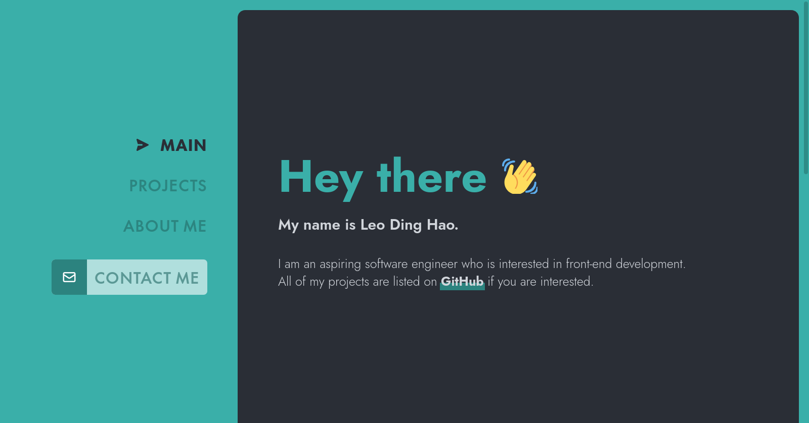

# [Portfolio Website](https://leodh.dev)

> Portfolio website built using NextJS as the framework. Other important
> libraries used are TailwindCSS, Framer-Motion and Next-MDX-Remote.



## Setup

1. Create a `.env` at the root directory. The `.env` file should look like such:

```sh
TELEGRAM_BOT_TOKEN=YOUR BOT TOKEN
TELEGRAM_USER_ID=YOUR USER ID
```

2. Run the following command to build and run the docker container. The web application will be running on http://localhost:7777/

```sh
docker-compose up
```
